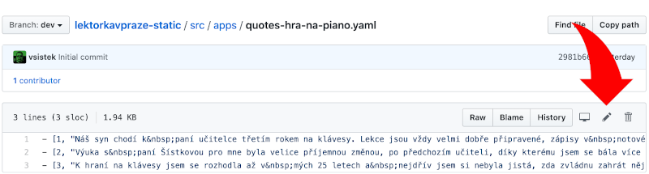

# HOWTO Change a File

## Using git CLI

1. Check out or update the repository
```shell
git clone https://github.com/vsistek/lektorkavpraze-static.git
cd lektorkavpraze-static
# If you had the repository cloned already, pull latest changes
git pull
```
2. Do your changes - example demonstrates how to change `src/04-aplikace.md`
```shell
# Open the file in your favourite editor, e.g. vi (or Atom), and do your changes
vi src/04-aplikace.md
```
3. Let git know that you really mean it for the next commit
```shell
# examine what git thinks of your workspace
git status
# Add what's really intended to the staging area
git add src/04-aplikace.md
# check status again - your change is green, it means staged
git status
```
4. Commit your staging area (sign it and add a comment what you meant by the change)
```shell
git commit -m "change apps menu layout"
# check log to see your new commit
git log
```
5. Push your change to GitHub. Your change gets deployed to www.lektorkavpraze.cz
```shell
git push

# If you cloned using https (as in this document),
# bear in mind that you will have to authenticate
# interactively using your GitHub credentials.
```
## Using GitHub BUI

1. Locate the file you want to change (using example `src/apps/quotes-hra-na-piano.yaml`)
```
https://github.com/vsistek/lektorkavpraze-static/blob/dev/src/apps/quotes-hra-na-piano.yaml
```
2. Edit the file using the pen icon

3. Scroll down on the same page, add a comment about you have done and commit
4. Change will get deployed to www.lektorkavpraze.cz automatically.
